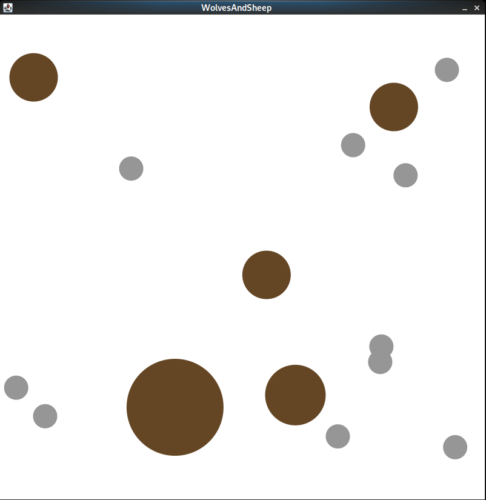

# U19 | Wolves and Sheep

Erstellen Sie ein Programm, in dem auf rudimentäre Art und Weise Jagen und Gejagt-werden anhand von Wölfen und Schafen simuliert wird.

## Anforderungen

- Alle Schafe und Wölfe:
  - starten auf einer zufälligen Position der Zeichenfläche
  - bewegen sich in eine zufällige Richtung mit einer zufälligen Geschwindigkeit
  - können die Zeichenfläche nicht verlassen, _prallen_ an den Kanten der Zeichenfläche ab und werden davon _abgelenkt_
  - werden als Kreise dargestellt mit einheitlicher Farbe für die Schafe (z.B. hellgrau) und einheitlicher Farbe für die Wölfe (z.B. braun)
- Wölfe starten als größere Kreise als Schafe
- Modellieren Sie Ihr Programm mit sinnvollen Klassen
  - Erstellen Sie eine Klasse `Animal` von der die Klassen `Wolf` und `Sheep` erben
  - Implementieren Sie in der Klasse `Animal` das Verhalten, das `Wolf` und `Sheep` gemeinsam haben (z.B. bewegen)
  - Implementieren Sie das Verhalten, das jeweils für Wölfe und Schafe spezifisch ist in deren jeweiligen Klassen

- Überlegen Sie sich sinnvolle Methoden und Datenstrukturen, um die Objekte ihres Programms zu verwalten (z.B. `Animal[]` in das Sie wegen Polymorphie Objekte von `Wolf` und `Schaf` speichern können) 
 
- Die Klassen `Animal`, `Wolf` und `Sheep`sind vollständig für deren jeweiligen Berechnungen von Verhalten zuständig
- Die Klasse `WolvesAndSheep` dient lediglich als Einstiegspunkt für Ihr Programm 
- Die Klasse `WolvesAndSheep` veranlasst, dass Objekte von `Wolf` und `Sheep` aktualisiert (z.B. Aufruf einer Methode `update()`) und gezeichnet werden (z.B. Aufruf einer Methode `draw()`)
- Testen Sie, ob zwei Tiere aufeinandergetroffen sind, also _kollidieren_ (d.h. ihre Kreise überlappen)
  - wenn ein Wolf und ein Schaf aufeinandergetroffen sind, frisst der Wolf das Schaf und wird größer (z.B. Radius des Kreises des Schafes auf den Radius des Kreises des Wolfs aufaddieren)
  - wenn ein Wolf und ein anderer Wolf aufeinandertreffen, kommt es zum Kampf, den der Größere der beiden Wölfe überlebt und der Kleinere nicht. Färben Sie hierfür den Kreis des unterlegenen Wolfes weiß und den Rand des Kreises (Border) rot. Der unterlegene Wolf kann sich daraufhin nicht mehr bewegen und interagieren.
  - wenn zwei Schafe aufeinandertreffen, dann gehen sich beide aus dem Weg
- Innerhalb eines festen Zeitintervalls, werden Wölfe, die kein Schaf gerissen haben, wegen Hunger kleiner (z.B. 10% ihrer vorherigen Größe aber mindestens drei Größeneinheiten)
- Wölfe die zu lange kein Schaf gerissen haben, verhungern (z.B. Kreisradius ist kleiner als definierter Wert) und werden dann ebenfalls weiß gefärbt, mit einem roten Rand versehen und können sich weder bewegen noch interagieren. 
